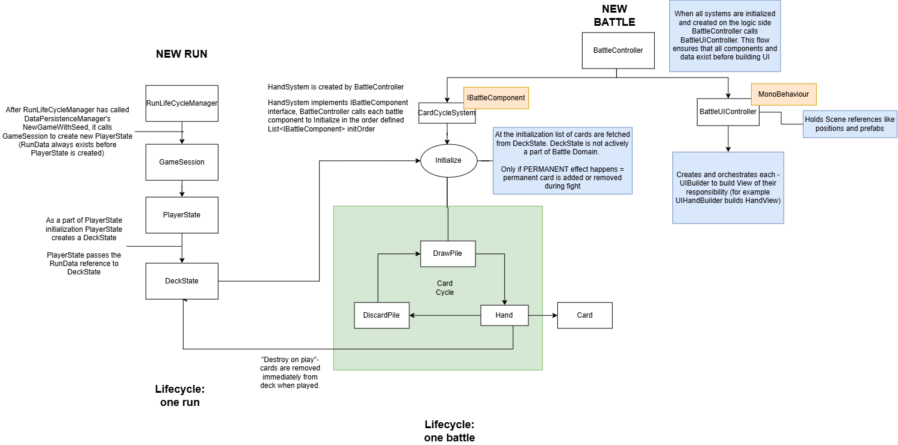

# Desolate Battle Domain — Code Excerpt

## About the Project
Desolate is a Unity/C# roguelite deckbuilder, co-developed with a friend
(art) — I handle systems and gameplay programming.

## What This Excerpt Shows
This repository is a curated slice of the game's Battle Domain, not the full
project, and is not meant to compile standalone. It focuses on the core
orchestration pattern and one representative subsystem (card hand/cycling)
rather than the full breadth of battle logic.

## Repository Structure
/Docs
  CardCycleSystem.drawio.png
  HandSystem.drawio.png
  Layers.drawio.png
/Scripts
  BattleController.cs
  /CardCycle
    CardCycleSystem.cs
    Hand.cs
  /Interfaces
    IBattleComponent.cs
    IBattleLinkable.cs
    IUIAnchorProvider.cs

## Architecture Overview
`BattleController` orchestrates independent systems — each implementing
`IBattleComponent` — through a controlled initialization order:

`InitializeNew` / `InitializeFromData` → `Link` (battle context) → UI setup

This ensures every system exists and is initialized before any system tries
to reference another, and before the UI is built from the resulting state.

## Domain / View Separation
Domain classes never reference UI/View classes directly — they expose events
instead. `Hand`, for example, communicates state changes via `OnCardAdded`
and `OnCardRemoved` rather than driving UI directly, keeping domain logic
testable and UI-agnostic. This boundary is enforced consistently across the
Battle Domain.

## CardCycleSystem
Manages `Hand`, `DrawPile`, and `DiscardPile`. Construction is
dependency-ordered: `DiscardPile` is independent, `Hand` depends on
`DiscardPile`, and `DrawPile` depends on both — so they're constructed in
that order.

## In Progress
Card lifecycle currently supports basic cycling (draw → hand → discard).
Once-per-battle cards (graveyard pile, reset each battle) and vanishing
cards are designed but not yet implemented. Effect resolution
(`ActionSystem`) — a hookable pipeline supporting counters, damage
prevention, and on-hit triggers — is designed but not yet built.

## Full Project
This is an excerpt; the full private repo is available on request.

